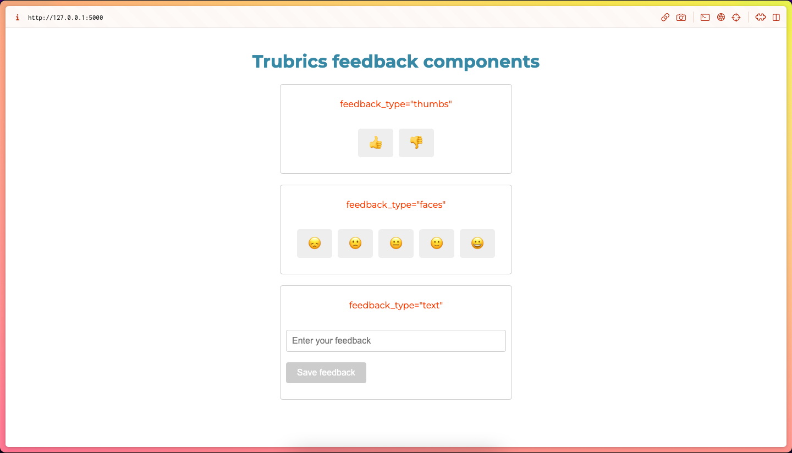

# Collect feedback from a Flask app

The following example shows how you can integrate Trubrics feedback directly in to your Flask application. We will be using Flask templates to render a UI (with HTML & CSS) that displays some different feedback types that you can collect and save to the Trubrics platform.

## Install
Install Trubrics & Flask to your virtual environment with

```bash
pip install trubrics flask
```

## Run the example app
Set your Trubrics email & password to the following environment variables:

```bash
export TRUBRICS_CONFIG_EMAIL=<your_trubrics_email>
export TRUBRICS_CONFIG_PASSWORD=<your_trubrics_password>
```

!!!tip "Trubrics platform access"
    To gain access for you and your team, get in touch with us [here](https://trubrics.com/demo/).

To directly run the application, clone the [trubrics-sdk](https://github.com/trubrics/trubrics-sdk) and run the following command from the root directory:

```
flask --app examples/feedback_apps/flask/app.py --debug run
```

Now open [http://127.0.0.1:5000](http://127.0.0.1:5000) to render the UI:


You can now navigate to the [Trubrics platform](https://ea.trubrics.com) to manage the feedback that you have collected.

In this example, we have showcased 3 different feedback types. Trubrics can, however, deal with more custom feedback by populating the `user_response=` dictionary field of the Feedback object.
