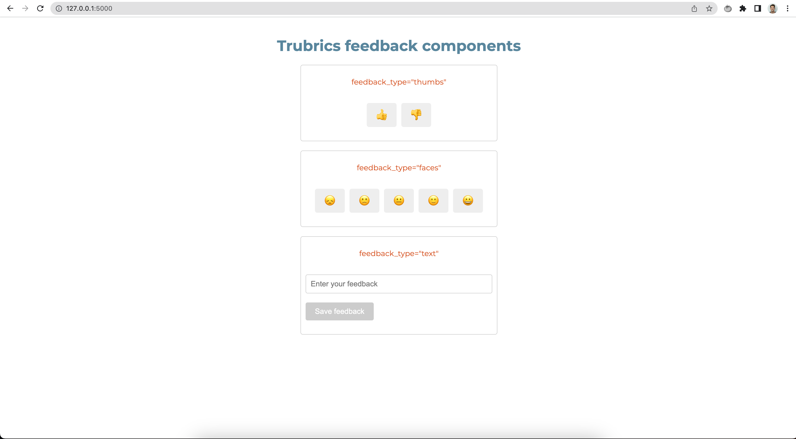

# Collect feedback from a Flask app

The following example shows how you can integrate Trubrics feedback directly in to your Flask application. We will be using Flask templates to render a UI (with HTML & CSS) that displays some different feedback types that you can collect and save to Trubrics.

## Install
Install Trubrics & Flask to your virtual environment with

```bash
pip install trubrics flask
```

## Run the example app
Set your Trubrics email & password to the following environment variables:

```bash
export TRUBRICS_EMAIL="trubrics_email"
export TRUBRICS_PASSWORD="trubrics_password"
export TRUBRICS_COMPONENT="trubrics_component_name"
```

To directly run the application, clone the [trubrics-sdk](https://github.com/trubrics/trubrics-sdk) and run the following command from the root directory:

```
flask --app examples/feedback/flask/flask_app.py --debug run
```

Now open [http://127.0.0.1:5000](http://127.0.0.1:5000) to render the UI:


You can now navigate to [Trubrics](https://trubrics.streamlit.app) to manage the feedback that you have collected.

In this example we have built all three feedback types, but only one should be used per feedback component.
